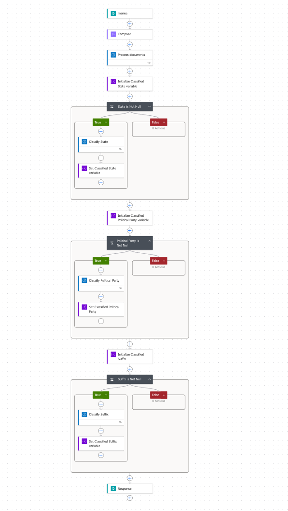

# Voter Registration

Voter registration can be a tedious process. This prompt showcases how to make this process easier by utilizing AI to read the form using Power Automate Flow. This can be combined on the front end with manual input to ensure the correct data is input while still allowing AI to assist.


## Power Automate Flow

This flow is triggered manually via HTTP Post. The flow follows as such:
1. Manual Trigger
2. Convert from base64 to pdf
3. Process Documents
4. Use AI to handle unique variables (state, party, and suffix)
5. Send Response



## Classify Prompt

The same classify prompts is used for each step. This can be used for example to classify states into their correct abbreviations.

```
Classify the [input] into one of the [input categories] or an empty string. Analyze the text and determine which abbreviation matches. If the text does not clearly fit into a single category, pick the closest category or return empty string. Your answer may only have the exact text of the closest category. Do not explain and do not use categories not listed.
```